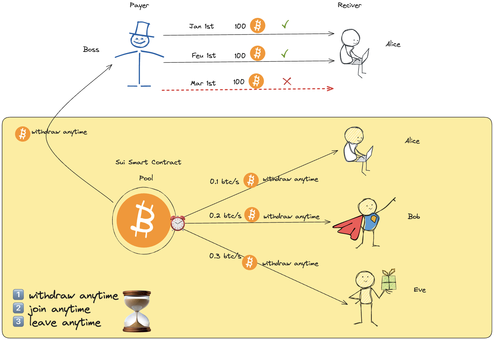

# Sui Nova

Sui Nova is a liquidity management and payment protocol specifically designed for the decentralized finance (DeFi) sector, aiming to simplify, automate, and bring transparency to cryptocurrency payment processes. As an innovative solution for blockchain users, Sui Nova offers a trustless way to facilitate continuous payments, addressing several challenges present in traditional payment systems.

# Why Sui Nova



With the rapid development of blockchain technology and the flourishing DeFi ecosystem, more users and businesses are turning to cryptocurrencies for payments. However, the current payment methods are typically based on one-time transactions, which are not ideal for scenarios requiring regular payments, such as salary disbursements, subscription services, and loan repayments. Additionally, traditional cryptocurrency payment processes often suffer from complexities, high fees, and a lack of transparency.

Sui Nova was created to tackle these challenges. Through Sui Nova, users can easily set up and manage recurring payments in a fully decentralized environment, ensuring transparency and automation in the payment process. This lowers the barriers to entry and enhances the efficiency and security of payments.

# Project Objectives

The goal of Sui Nova is to create a simple, reliable, and transparent cryptocurrency payment system, providing users and businesses with better liquidity management tools. Through smart contracts, Sui Nova can execute payments automatically without human intervention, reducing the possibility of human error. The protocol also gives users greater control and visibility, making the payment process more transparent and auditable.

# Core Features

- **Liquidity Management**: Sui Nova enables users to manage the liquidity of their cryptocurrency assets, ensuring the proper allocation and utilization of funds.
- **Automated Payments**: Sui Nova allows users to set up automated recurring payments, such as salaries and subscription fees, thereby simplifying the payment process.
- **Decentralization and Transparency**: All payments are executed on-chain via smart contracts, ensuring transparency and immutability in the payment process.

# Problems Solved

Sui Nova addresses several key issues in traditional cryptocurrency payments:
- **Cumbersome Recurring Payments**: By automating the execution of recurring payments through smart contracts, the operation is simplified.
- **Complexity in Fund Management**: With transparent liquidity management tools, fund management becomes more intuitive and efficient.
- **Trust Issues**: A fully decentralized payment system eliminates the need for intermediaries, enhancing user trust in the system.

# Application Scenarios

Sui Nova has a wide range of potential application scenarios, including but not limited to:
- **Salary Disbursements**: Companies can use Sui Nova to set up an automated salary payment system without manual intervention.
- **Subscription Services**: Users can utilize Sui Nova to automatically pay subscription fees, avoiding missed payment deadlines.
- **Loan Repayments**: Borrowers can establish automatic repayment plans through Sui Nova, ensuring timely loan repayments.

# Development 
```
# mainnet packageId : 0xa769a20c9b8e80078bdad52ce1a2ecc4fb0d7c8df815e3b089bb6893913042e5
# Digest : HvdkDmgjy8jdiXosTH9etjUwrvmE7fXrdC66bntVk1ZA
```